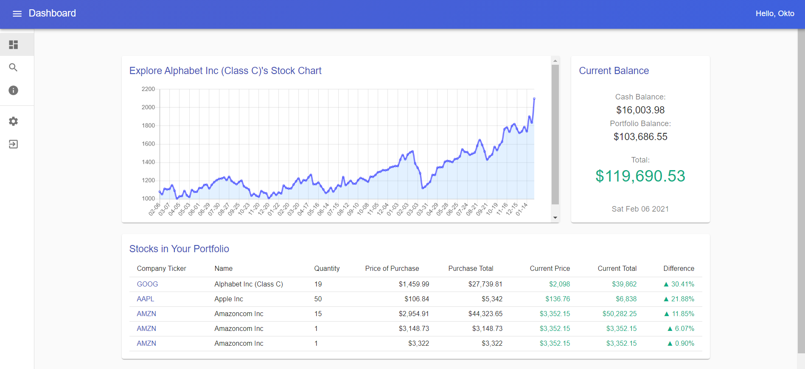

# Stock Trading Simulator

## Contents
* [About](#about)
* [Installation](#installation)
* [Video](#video)


## About
Welcome to my Stock Trading Simulator! 

The goal of this web app is to allow users to learn about investing in a fun and risk-free manner. Users can access stock data and charts and use the app to buy and sell stocks using their $100k budget to simulate in a simplistic way the investing process.


It consists of a dynamic ReactJS frontend using Material UI, React Routing and Hooks. The backend API uses NodesJS and ExpressJS to perform user authentication and user and stock information retrieval. Furthermore, the data is stored in a MongoDB database.
\
\
\



## Installation
Make sure you have NodeJS installed. Then install the required packages for the server with:

```sh
npm install
```

And the required packages for the client with:
```sh
npm run install-client
```


Then run the server with:
```sh
npm run start
```
And run the client with:
```sh
cd client
npm run start
```


## Video
[Watch demo video](https://www.veed.io/view/06942e78-eeb0-44cc-9d28-f76074bb8725?source=editor&panel=share)
